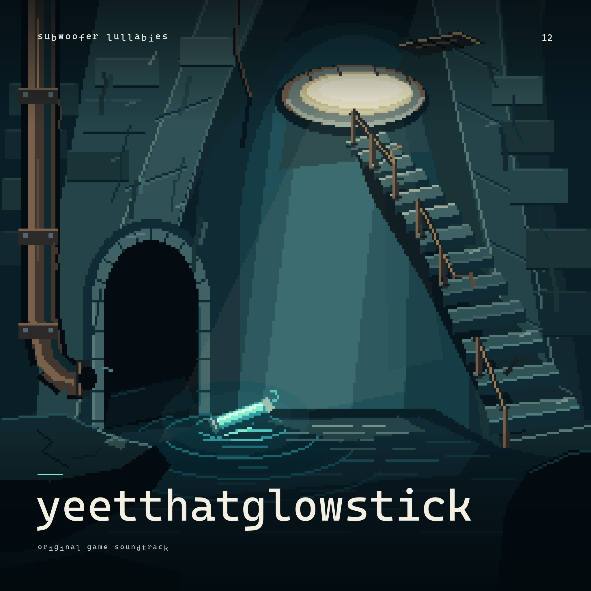

# YeetThatGlowStick

Twelve retro game tracks: a journey through sewer darkness, small discoveries, loss and the climb toward daylight.

**[Browse this album](index.html)** / **[Full collection](../README.md)**

## Track list

| # | Song | Arrangement | Artwork / note |
|---|---|---|---|
| 01 | [anticipation](anticipation/anticipation.strudel) | Main menu | [Cover](anticipation/cover.png) / [Rights](anticipation/RIGHTS.md) |
| 02 | [dismay](dismay/dismay.strudel) | Opening cinematic | [Cover](dismay/cover.png) / [Rights](dismay/RIGHTS.md) |
| 03 | [vulnerability](vulnerability/vulnerability.strudel) | Level 1 / First Light | [Cover](vulnerability/cover.png) / [Rights](vulnerability/RIGHTS.md) |
| 04 | [delight](delight/delight.strudel) | Item discovery stinger | [Cover](delight/cover.png) / [Rights](delight/RIGHTS.md) |
| 05 | [curiosity](curiosity/curiosity.strudel) | Level 2 / Someone Was Here | [Cover](curiosity/cover.png) / [Rights](curiosity/RIGHTS.md) |
| 06 | [determination](determination/determination.strudel) | Level 3 / The Long Climb | [Cover](determination/cover.png) / [Rights](determination/RIGHTS.md) |
| 07 | [loss](loss/loss.strudel) | Late-Level-3 C-19 cinematic | [Cover](loss/cover.png) / [Rights](loss/RIGHTS.md) |
| 08 | [courage](courage/courage.strudel) | Legacy headlamp discovery proposal | [Cover](courage/cover.png) / [Rights](courage/RIGHTS.md) |
| 09 | [resilience](resilience/resilience.strudel) | Level 4 / Flood Levels | [Cover](resilience/cover.png) / [Rights](resilience/RIGHTS.md) |
| 10 | [hope](hope/hope.strudel) | Level 5 / Near the Surface | [Cover](hope/cover.png) / [Rights](hope/RIGHTS.md) |
| 11 | [relief](relief/relief.strudel) | Surface ending | [Cover](relief/cover.png) / [Rights](relief/RIGHTS.md) |
| 12 | [perseverance](perseverance/perseverance.strudel) | Complete game theme | [Cover](perseverance/cover.png) / [Rights](perseverance/RIGHTS.md) |

Only the twelve retro/chiptune tracks belong to this album. The non-chiptune
[serenity](../serenity/serenity.strudel) and independent
[euphoria](../euphoria/euphoria.strudel) remain outside it. Song titles stay lowercase;
the album keeps the requested **YeetThatGlowStick** name.

These are preserved Strudel sources, not a mastered audio album. See the
[collection playback/export guide](../README.md#playback) for timing and sample loading.
The original [cue sheet](../CUE_SHEET.txt) and
[menu transition](../MENU_LEVEL01_TRANSITION.txt) remain at the collection root.
courage is the legacy discovery cue; loss is the current C-19 cinematic score.

## Cover and rights

The original album cover uses character-free environmental pixel art and clean
monospace lettering. [Editable source, typography and provenance](../../artwork/albums/YeetThatGlowStick/README.md)
are saved separately; each track keeps its own individual cover.

Read every track's linked rights note before publishing audio. In particular,
anticipation, vulnerability and perseverance retain unresolved TR707 sample provenance.
Grouping these sources into an album does not clear sample permissions, establish
exclusive copyright or guarantee acceptance by YouTube, SoundCloud or Content ID.

`album.json` records track order, local score paths and cover hashes.
