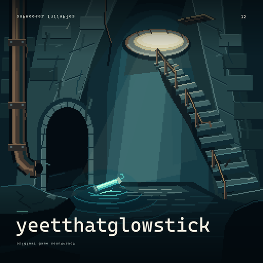

# YeetThatGlowStick - original album artwork



An original, empty cistern: an open manhole throws distant daylight over a worn
stairway, interrupted rails and damp masonry. A cyan glowstick floats at the
waterline beside a disused outfall; its ripples connect the foreground to the
route upward. The composition is new, not a collage or a reused song cover.
There are no characters, bodies, faces or character silhouettes.
There are no decorative droplet symbols or suspended drip accents; water is
confined to the sewer surface and its grounded reflections and glowstick ripples.

The album's exact metadata and folder name is **YeetThatGlowStick**. Its displayed
title is **yeetthatglowstick**, matching the collection's lowercase typography.
The caption reads **original game soundtrack**. The upper-right **12** is the
track count, not a catalogue number, release year or age rating.

## Twelve-track scope

anticipation, dismay, vulnerability, delight, curiosity, determination, loss,
courage, resilience, hope, relief, perseverance.

**serenity and euphoria are excluded.** This folder contains artwork, not audio
masters or revised music sources.

## Editable sources and exports

- [`YeetThatGlowStick.spritecanvas.json`](YeetThatGlowStick.spritecanvas.json):
  native **256 x 256** SpriteCanvas v1 project, one static frame, seven independently
  editable layers, **53** working swatches and **458,752** editable cells.
- [`scene.png`](scene.png): opaque native composite, rendered and validated through
  SpriteCanvas's shared model and PNG encoder.
- [`design.json`](design.json): editable layout, lowercase title, caption, colors,
  font references and font hashes. Every text element uses **Cascadia Mono**.
- [`cover.png`](cover.png): **2048 x 2048 opaque RGB** final cover. The scene is
  shaded on its native grid and enlarged exactly 8x with nearest-neighbor sampling;
  separately antialiased type is then added. This is not a pure pixel-only export.
- [`preview.png`](preview.png): **512 x 512** display preview of the final cover,
  downsampled with Lanczos so the typography remains clean.
- [`provenance.json`](provenance.json): protected handoff identity and hash,
  drawing-recipe/helper hashes, dimensions, palette and non-mutation statements.
- [`manifest.json`](manifest.json): album identity, scope and SHA-256 correspondence.

The seven layers, in compositing order, are chamber depth, cistern masonry, rising
stairway, pipes and worn rails, water and reflections, daylight and glowstick,
and broken foreground ledges. Transparent native pixels keep each object editable;
the bottom layer makes the complete scene opaque.

## Re-export saved edits

From the repository root, using the existing Python/Pillow/NumPy and Node setup:

```powershell
python .\tools\album_cover.py --studio-root "C:\devdesk\gamedesk\SpriteCanvas"
python .\tools\album_cover.py --studio-root "C:\devdesk\gamedesk\SpriteCanvas" --check
```

Normal export uses the **saved project and design**, not the drawing recipe. The
shared renderer normalizes the project JSON, renders `scene.png`, and the tool
updates the final images and manifest. `--check` compares the native render,
final images and hashes without writing files. Neither command installs artwork
into song bundles or changes the catalogue.

To deliberately recreate the original sources from an unchanged, protected
**blank** handoff:

```powershell
python .\tools\album_cover.py --studio-root "C:\devdesk\gamedesk\SpriteCanvas" --draw --handoff ".\path\to\handoff.json"
```

Existing sources or exports are protected. Add **`--redraw`** only when intentionally
discarding saved scene/design edits; it is invalid without `--draw`. A pending
proposal, locked layer or existing pixel in the baseline is rejected. The handoff
is validated but never overwritten. Retain your original handoff privately.

## Provenance and validation

This independent saved project retains the protected blank baseline's project ID.
The September 27, 2026 read-only studio inspection observed revision **3**, an
empty 32 x 32 source, and no proposal. That observation is historical, not a claim
about the studio's future live state. No artwork was proposed, accepted, imported
into the live workspace, or installed into the song bundles by this artwork tool.

The native image, integer-enlarged native image and composed preview were opened
for visual inspection. These are internal production checks, not user approval.

The manifest's required fields are `title`, `description`, `source`,
`source_sha256`, `scene_sha256`, `design_sha256`, `provenance_sha256`, and
`export_sha256`. Each hash is SHA-256 of the corresponding saved file.
`export_sha256` identifies `cover.png`; `preview_sha256` identifies `preview.png`.
Additional fields record dimensions, medium, the twelve titles and exclusions.

All imagery is authored by the local drawing recipe; no downloaded image or
stock asset is included. Locally installed Cascadia Mono is referenced and
rasterized only. No font binary is distributed. Its upstream license is
[SIL Open Font License 1.1](https://github.com/microsoft/cascadia-code/blob/main/LICENSE).
These artwork notes do not change the tracks' separate sample/rights assessments.
