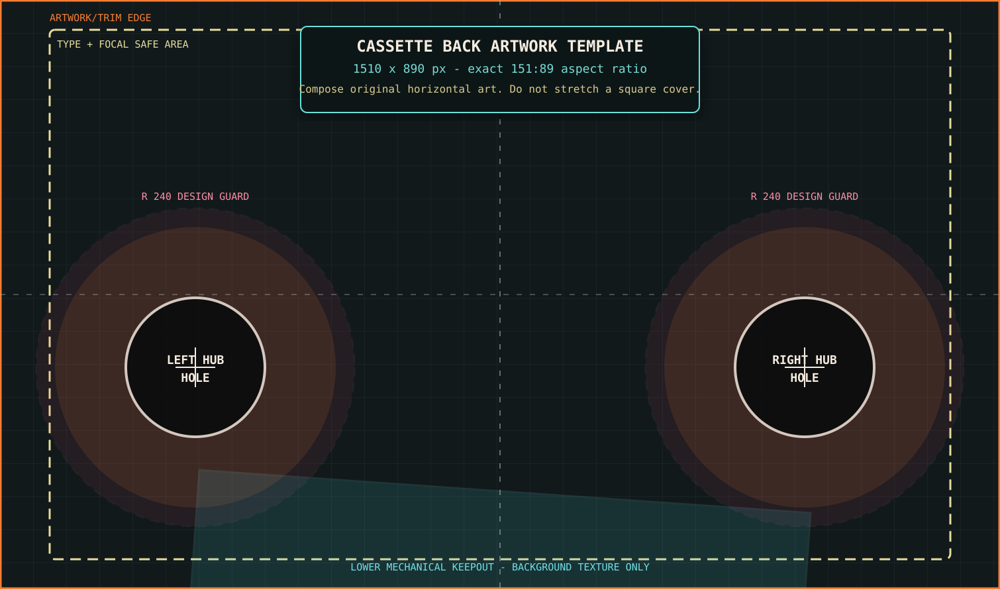
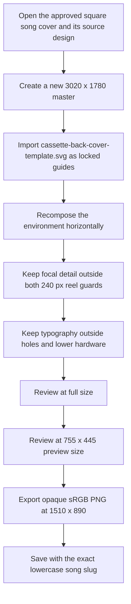

# Cassette back-cover design specification

> **Purpose:** This is the production contract for creating dedicated horizontal back-cover artwork for every Subwoofer Lullabies song cassette. It is written so another design agent can produce the complete asset set without guessing geometry, stretching square covers, placing details under the reel holes, or replacing the existing square artwork.



*The template is an importable `1510 x 890` SVG. The orange edge is the full texture, the cream dashed rectangle is the content-safe area, the pink/orange circles reserve the reel mechanisms, the dark circles are the hub holes, and the cyan area marks lower cassette hardware.*

## 1. Why the current back covers look stretched

The website currently loads each square song cover directly onto this Three.js plane:

```ts
new THREE.PlaneGeometry(3.02, 1.78)
```

The plane's exact aspect ratio is:

```text
3.02 / 1.78 = 151 / 89 = 1.696629...
```

Every current website cover is `2048 x 2048`, or `1:1`. Three.js maps the complete image across the complete `151:89` plane. It does not preserve the square image's original proportions or crop it into a horizontal window. A square composition therefore becomes approximately **69.7% wider relative to its height**, which is the distortion visible on the cassette backs.

The fix is **not** to resize a square cover to a wider file. Each cassette back needs a deliberate horizontal recomposition made at the cassette plane's native `151:89` ratio.

The existing square files under `site/public/covers` remain canonical for album cards, the CRT and other square-cover surfaces. Dedicated cassette-back assets must be separate files.

## 2. Required asset set

Create exactly fourteen song assets under a new directory:

```text
site/public/cassette-backs/
```

Required filenames:

```text
anticipation.png
courage.png
curiosity.png
delight.png
determination.png
dismay.png
hope.png
loss.png
perseverance.png
relief.png
resilience.png
serenity.png
euphoria.png
vulnerability.png
```

Do not overwrite or rename the square files in `site/public/covers`. The YeetThatGlowStick album cover is not a song cassette back and is outside this fourteen-file deliverable.

## 3. Canvas and export contract

| Property | Required value |
|---|---:|
| Exact aspect ratio | `151:89` |
| Working master | `3020 x 1780 px` |
| Website export | `1510 x 890 px` |
| Optional lightweight preview | `755 x 445 px` |
| Color space | sRGB |
| File format | PNG-24, opaque |
| Orientation | Landscape, never rotated |
| Alpha holes | Do not cut yet; reserve the zones in the composition |
| Filename | Lowercase song slug plus `.png` |

The master and website sizes are exact multiples of the Three.js geometry:

```text
3020 x 1780 = 1000 pixels per Three.js unit
1510 x  890 =  500 pixels per Three.js unit
 755 x  445 =  250 pixels per Three.js unit
```

Do not export at `16:9`, `3:2`, `2:1`, `2048 x 2048`, or any other convenient ratio. Do not add letterboxing. Do not depend on CSS or Three.js to crop the result.

## 4. Coordinate system

All pixel coordinates below use the required `1510 x 890` website export:

- Origin: top-left.
- Positive X: right.
- Positive Y: down.
- Canvas center: `(755, 445)`.
- Full artwork bounds: `x = 0..1510`, `y = 0..890`.
- Recommended text/focal safe bounds: `x = 75..1435`, `y = 45..845`.

For a `3020 x 1780` master, multiply every coordinate and radius in this document by `2`.

Normalized coordinates are provided for agents working in Figma, Blender, Photoshop, SVG or procedural tools:

| Feature | X | Y |
|---|---:|---:|
| Left reel center | `19.5364%` | `62.3596%` |
| Right reel center | `80.4636%` | `62.3596%` |
| Canvas center | `50%` | `50%` |

## 5. Reel and hub-hole geometry

The cassette model places its reel centers at Three.js coordinates `(-0.92, -0.22)` and `(0.92, -0.22)`. On the horizontal artwork, those become:

| Zone | Left reel | Right reel |
|---|---:|---:|
| Center | `(295, 555)` | `(1215, 555)` |
| Physical outer reel radius | `210 px` | `210 px` |
| Physical hub-hole radius | `105 px` | `105 px` |
| Recommended design-guard radius | `240 px` | `240 px` |

Use the zones as follows:

1. **Hub hole: radius 105 px**
   - Treat this as a future punch-out.
   - Do not place text, logos, faces, focal objects, borders, horizon joins or unique details inside it.
   - Continue only expendable background texture underneath it.
   - Do not bake highlights or shadows that imply the hole is somewhere else.

2. **Physical reel: radius 210 px**
   - The full spool can occupy this area.
   - Use low-detail background only.
   - Avoid high-contrast edges that will look broken when the reel/hole geometry is shown.
   - Do not place a subject so that a reel appears to cut through it.

3. **Design guard: radius 240 px**
   - This adds `30 px` clearance around the physical reel.
   - Keep all titles, subtitles, emblems and focal details outside this circle.
   - Soft gradients, atmosphere, water, wall texture, sky, shadow and other continuous background material may pass through.

The two wheel locations are symmetrical. Never move them to suit a composition.

## 6. Lower mechanical keepout

The cassette model includes a lower mechanism centered at Three.js `(0, -0.81)`, sized `1.85 x 0.43`, with a `-0.07` radian rotation.

On the `1510 x 890` image template, reserve:

```text
center:   (755, 850)
size:     925 x 215 px
rotation: +4.01 degrees in image coordinates
```

Much of this rectangle extends below the artwork boundary, but its visible upper portion overlaps the bottom-center of the back cover.

- Do not place titles, small text, logos, faces, focal objects or critical silhouettes in this zone.
- Continue only broad background color and texture.
- A horizon, frame or strong line must not terminate inside the keepout.
- Keep the bottom `45 px` inside the general safe margin even outside this mechanism.

## 7. Composition map

Use this priority order:

1. **Primary focal area:** upper middle, approximately `x = 430..1080`, `y = 90..340`.
2. **Secondary detail areas:** upper-left and upper-right corners inside the safe bounds.
3. **Atmosphere/background:** may continue behind reel guards and mechanical areas.
4. **Typography:** top band or upper middle only; never across the reel line.
5. **Bottom region:** background continuation only.

Recommended content rules:

- Preserve the song's established palette, location, mood and environmental storytelling.
- Recompose scene elements horizontally; do not crop a square source until it happens to fit.
- Extend environments naturally using walls, floors, sky, water, architecture, light, shadow or texture.
- Preserve perspective. Do not stretch circular lights, windows, moons, arches, instruments or props into ellipses.
- The cassette front already contains the handwritten song title. A title on the back is optional, not required.
- If a title is included, it must remain lowercase and use the established cover medium's typography.
- Do not add characters, faces, bodies or character silhouettes.
- Keep the current medium of each song: retro/chiptune covers may remain pixel-art based; smooth non-chiptune covers must remain polished non-pixel artwork.
- Avoid tiny detail that disappears when the physical cassette is viewed at room scale.
- Use deliberate edge continuation because the image reaches the complete artwork plane; there is no automatic border inside the texture.

## 8. Per-song production workflow



For every song, the design agent must preserve:

- the approved concept and emotional intent;
- the current palette family;
- recognizable environmental motifs;
- the absence of characters;
- clean proportions;
- the reserved reel and mechanism zones;
- exact `151:89` output.

## 9. Template usage

Canonical template:

```text
docs/assets/cassette-back-cover-template.svg
```

The SVG contains a `guides` group and is already sized to `1510 x 890`.

Recommended use:

1. Import the SVG into the design tool without resizing the artboard.
2. Lock the `guides` group.
3. Create artwork below the guides.
4. Keep the guides visible during composition and review.
5. Hide the guides before export.
6. Export the complete artboard, not a selection.

Guide colors:

- Orange rectangle: exact texture boundary.
- Cream dashed rectangle: general safe area.
- Pink dashed circles: design guards.
- Orange circles: physical reel extents.
- Dark circles: future hub holes.
- Cyan rotated rectangle: lower mechanical keepout.

## 10. Acceptance checklist for each file

An asset is complete only when every answer is **yes**:

- [ ] The file is exactly `1510 x 890`.
- [ ] The artwork was recomposed horizontally rather than stretched from square.
- [ ] Circular and square scene elements retain correct proportions.
- [ ] No text or focal detail enters either `240 px` reel guard.
- [ ] Both `105 px` hub holes contain expendable background only.
- [ ] The lower mechanical keepout contains background only.
- [ ] The title, if present, is lowercase.
- [ ] The established song palette and environment remain recognizable.
- [ ] No character, face, body or character silhouette was added.
- [ ] The correct pixel/smooth medium was preserved.
- [ ] The image remains readable at `755 x 445`.
- [ ] The export is opaque sRGB PNG.
- [ ] The filename exactly matches the required lowercase song slug.
- [ ] The existing square cover was not modified.

## 11. Integration contract for the implementation agent

The design agent should only create the fourteen files. A later implementation change should:

1. Add a dedicated cassette-back path to each song record.
2. Load that path only for `cassette.back.material`.
3. Continue loading the square cover for album cards, CRT display and other square surfaces.
4. Keep the front masking-tape title unchanged.
5. Add actual back-side reel/hole geometry or an alpha-capable mask only after the dedicated assets exist.
6. Test the back in the held-cassette rotation, random inspection, room tapes and inserted player.

Current code uses an opaque `MeshBasicMaterial` for the back plane, so transparent circles in a PNG would not create physical holes today. That is why this specification reserves the hole areas but requires an opaque export. The geometry/masking implementation must be handled separately and must use the exact coordinates documented above.

