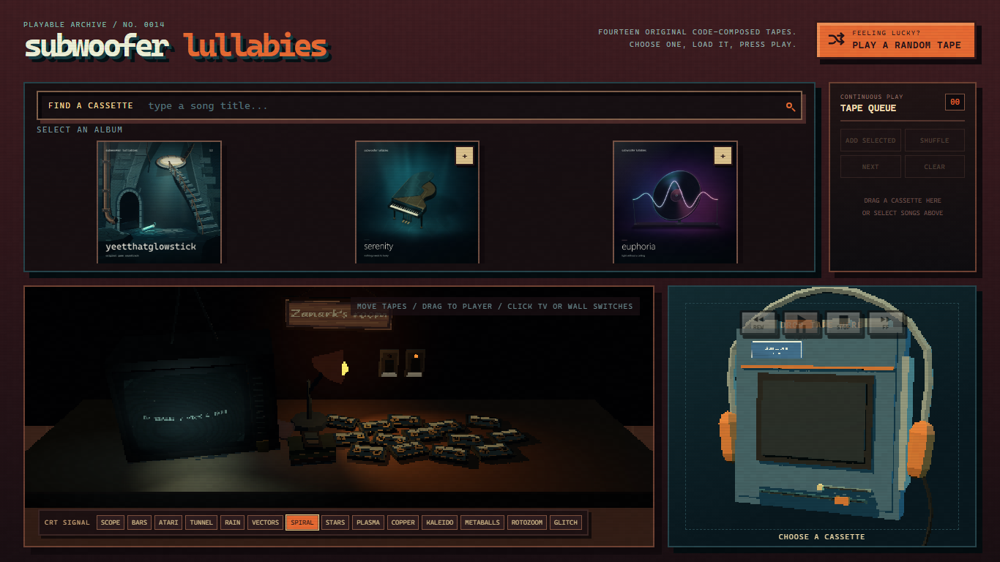
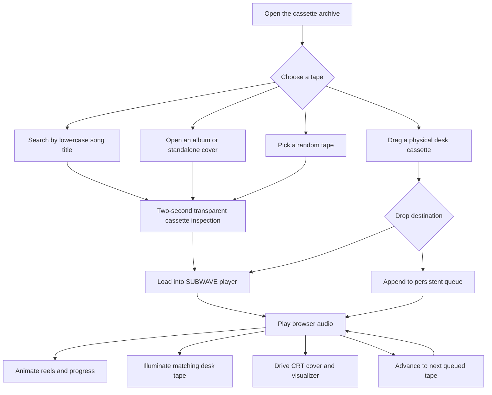
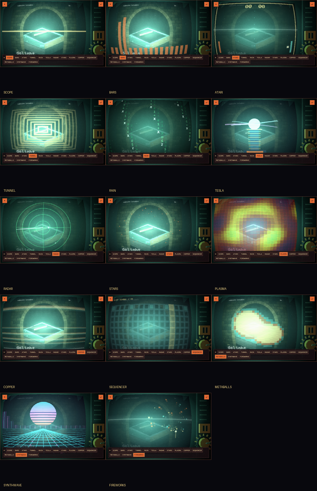
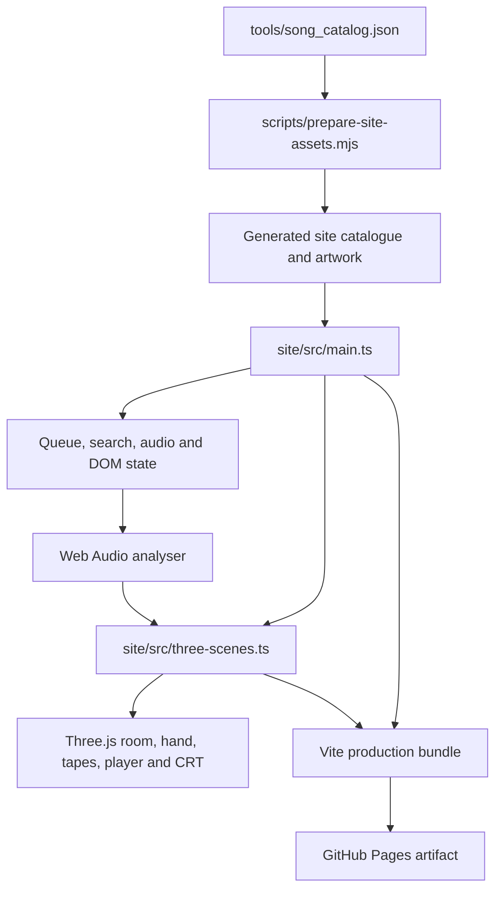

# Playable cassette archive

The [Subwoofer Lullabies cassette archive](https://zanark.github.io/SubwooferLullabies/)
turns the fourteen-track collection into an interactive PS1-style bedroom desk. It is
not a flat skin around an audio element: the room, tapes, hand, portable player, wall
switches and convex television are rendered as low-poly Three.js geometry.



*The desktop composition keeps the searchable library and persistent queue above the
room. The Three.js room occupies the left two-thirds of the lower row; the fictional
SUBWAVE player occupies the right third.*

## 1. Experience map



The inspection layer stays transparent so the room never disappears behind a
separate theater screen. The cassette rotates for two seconds, showing its handwritten
title on the front and the track artwork on the back, before entering the player.

## 2. Finding and handling tapes

The library offers three paths into the same physical interaction:

- Search matches song titles only. Matching cassettes rise from the desk, rotate and
  sit under warm spotlights whose sources remain above the visible room framing.
- Album and standalone cover cards open a grid of songs. A song can be loaded
  immediately or selected for the queue.
- **Play a random tape** chooses a non-current song without clearing or rearranging
  the saved queue.

Every physical cassette can be repositioned on the desk. Hovering or dragging a tape
summons a transparent low-poly hand; empty room space and ordinary controls retain the
native pointer. Pointer capture, cancellation handling and edge auto-scroll allow the
same interaction to work with mouse or touch.

Picking up a physical cassette, dragging a library card or starting the transparent
two-second cassette showcase automatically enters **player focus**. The masthead,
library, room and footer dim almost completely while the SUBWAVE player blooms in
cyan, mint and warm orange light. The queue remains fully visible and interactive so
the cassette can still be routed to **play now** or **play later** without leaving the
focused composition.

## 3. The fictional portable player

The **SUBWAVE TPS-14** is an original fictional design inspired by the proportions and
materials of portable cassette players without copying a real manufacturer.

- REW, PLAY/PAUSE, STOP and FF are mechanical-looking controls on the device.
- PLAY/PAUSE produces a short Web Audio transport thunk.
- The long lower groove is the draggable volume control.
- The shorter upper groove is a position indicator with no elapsed-time text.
- Both visible cassette reels rotate clockwise at a restrained visual speed while
  playback is active.
- Directly loading or randomly choosing a tape changes the current cassette without
  mutating the persistent queue.

Audio is supplied by fourteen committed 160 kbps MP3 derivatives of the verified
full-length WAV exports. Catalogue `loop` tracks repeat during direct playback;
queue playback disables looping so the browser can advance to the next entry.

## 4. Continuous-play queue

The top-right tape queue is stored in browser local storage and survives reloads.
Users can:

- select multiple song cards and append them together;
- append every song from the currently open album;
- drag a library card or physical Three.js cassette into the queue;
- shuffle, play next, clear, remove or move individual entries;
- drag queue rows to reorder them;
- see the current song highlighted automatically; and
- read long active titles through an automatic horizontal marquee.

The current direct/random track appears separately from the saved entries. This keeps
spontaneous playback from silently destroying a carefully arranged queue.

## 5. Zanark's room

The room is a dark Indian teenager's desk around 2010, built from deliberately chunky
geometry, low-resolution textures, nearest-neighbor filtering and flat-shaded
materials.

- The panoramic back wall and laminate desk span the complete room viewport.
- Fourteen loose cassettes share the desk with books, CD cases, pencils, a feature
  phone and a warm table lamp.
- A handmade wooden plaque identifies **Zanark's room**. The earlier film-homage
  posters are parked in code and are not currently mounted.
- Physical wall switches independently control the overhead light and table lamp.
- With both circuits off, the room remains near-black except for local emissive
  sources such as the CRT, switch indicators and active lamp bulb.

The CRT samples the dominant hue of the current cover for its room lighting, but the
screen itself preserves and brightens the cover's individual colors. A shadowed,
forward/downward pool reaches across the desk without creating an implausible rear-wall
halo. During playback, the matching physical cassette receives a stationary
cover-colored glow.

## 6. Convex CRT and signal library

Clicking the television moves the room camera into a centered first-person view. The
screen is a bowed low-poly mesh with recessed bezel, deep cabinet, speaker grille and
bright phosphor bloom. **Dim surroundings** darkens the rest of the page without
turning off the room, and **back to room** restores the original camera.

All signals use live Web Audio analyser data. Nonlinear frequency amplification and
adaptive waveform gain keep quieter recordings visibly responsive.

| Signal | Visual family |
|---|---|
| `scope` | Adaptive time-domain waveform |
| `bars` | Nonlinear frequency columns |
| `atari` | Nested audio-controlled diamonds inspired by Atari Video Music |
| `tunnel` | Receding perspective rectangles |
| `rain` | Falling spectral columns |
| `vectors` | Delayed-waveform XY vector trace |
| `spiral` | Frequency-modulated single helix |
| `stars` | Spectral depth field |
| `plasma` | Chunky multi-field demoscene plasma |
| `copper` | Moving horizontal raster/copper bands |
| `kaleido` | Rotating mirrored spectral wedges |
| `metaballs` | Audio-sized chunky scalar-field blobs |
| `rotozoom` | Rotating and zooming checker texture |
| `glitch` | Displaced horizontal image strips |



*The common cover and camera framing make the visual differences explicit. Redundant
expanding-ring and duplicate waveform-XY modes were removed before these six new
families were added.*

An intermittent phosphor scan band also crosses the complete television image from
top to bottom. This refresh sweep is independent of the selected signal.

## 7. Responsive composition

At desktop widths, the library spans the top row. The lower row uses a two-thirds room
and one-third player split, with the room on the left. Below 1181 px the sections stack
instead of compressing the Three.js scenes.

Above 1920 px, the masthead and workstation share a centered 2200 px maximum workspace.
The three primary cover cards remain in bounded columns instead of drifting apart on
2K and ultrawide monitors. Controls wrap rather than introducing horizontal scrolling,
and the enlarged interface typography remains readable at normal browser zoom.

## 8. Runtime architecture



`site/src/main.ts` owns catalogue navigation, queue persistence, audio transport,
drag/drop targets and CRT controls. `site/src/three-scenes.ts` owns the WebGL scenes,
physical interaction, lighting, cassette animation and canvas-based CRT rendering.

## 9. Local development

Requirements are Node.js 24 and a modern browser with WebGL and Web Audio support.
From the repository root:

```powershell
npm install
npm run dev
```

Create the production bundle with:

```powershell
npm run build
```

The build first runs `scripts/prepare-site-assets.mjs`, then TypeScript checking and
Vite. Generated output is written to `dist` and remains Git-ignored.

## 10. GitHub Pages deployment

The production site is intentionally isolated to the `deployment/pages` branch.
`.github/workflows/deploy-pages.yml` runs on pushes to that branch and also guards both
jobs with:

```yaml
if: github.ref == 'refs/heads/deployment/pages'
```

The workflow installs dependencies with `npm ci`, builds the Vite site, uploads
`dist`, and deploys through the `pages-deployment` environment. The Vite base path is
`/SubwooferLullabies/`, matching the project Pages URL.

## 11. Design invariants

Future changes should preserve these constraints:

1. Physical room objects remain genuine Three.js geometry rather than CSS pseudo-3D.
2. The PS1 treatment remains low-poly, pixelated and nearest-neighbor filtered.
3. The fictional player must not acquire Sony branding or copied manufacturer art.
4. Search continues to match titles only.
5. Direct and random playback never clear or reorder the saved queue.
6. CRT lighting remains directional and physically local; no rear-wall halo or
   uniform color wash over the cover.
7. CRT modes remain visibly different rather than multiplying variants of the same
   ring, waveform or particle family.
8. Desktop, 2K, ultrawide and stacked layouts avoid horizontal page scrolling.
9. Deployment remains restricted to `deployment/pages`.
